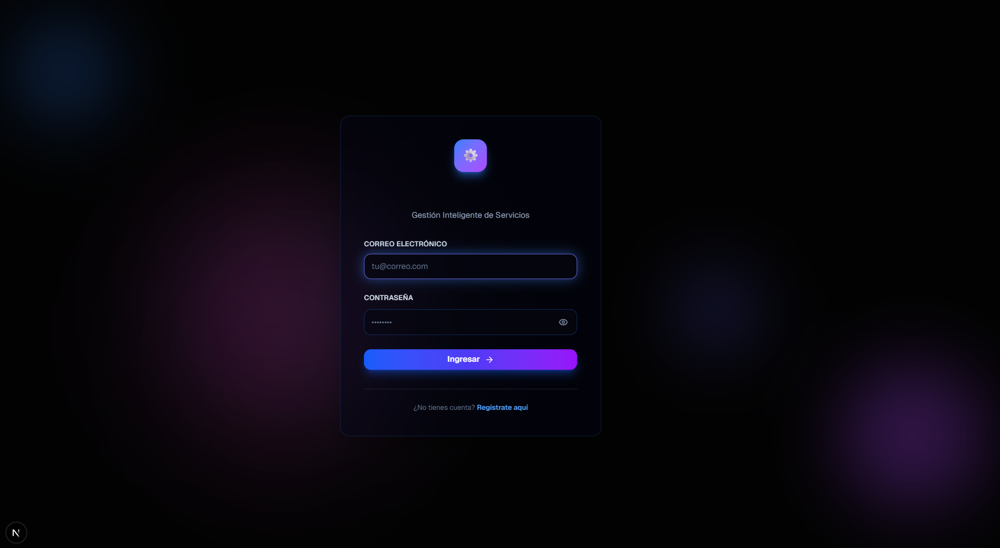

# 🌟 Helix Service Desk Suite

Sistema integral de gestión de servicios (Service Desk) construido con Next.js 16, React 19 y TypeScript. Una solución moderna y elegante para la administración de tickets, servicios y soporte técnico.



## ✨ Características

### 🎯 Gestión de Servicios
- **Catálogo de Servicios**: Organización y gestión completa de servicios disponibles
- **Plantillas Personalizables**: Creación de formularios dinámicos para solicitudes de servicio
- **Gestión de Categorías**: Clasificación y organización de servicios por categorías

### 📊 Panel de Administración
- **Dashboard Intuitivo**: Métricas en tiempo real y actividad reciente
- **Gestión de Usuarios**: Administración completa de usuarios y permisos
- **Auditoría**: Registro completo de actividades del sistema
- **Calendario**: Gestión de eventos y programación de servicios

### 🎨 Características de UI/UX
- **Diseño Moderno**: Interfaz limpia y profesional con efectos visuales suaves
- **Modo Oscuro/Claro**: Cambio de tema con soporte completo
- **Responsive**: Diseño adaptativo para todos los dispositivos
- **Animaciones Fluidas**: Transiciones suaves con Framer Motion y GSAP
- **Componentes Reutilizables**: Biblioteca completa de componentes UI

### 🔧 Funcionalidades Técnicas
- **SLA Management**: Gestión de acuerdos de nivel de servicio
- **Constructor de Formularios**: Creador visual de formularios personalizados
- **Sistema de Autenticación**: Pantalla de login y registro con animaciones
- **Notificaciones**: Sistema de notificaciones toast con Sonner

## 🚀 Stack Tecnológico

### Frontend
- **Next.js 16** - Framework de React con App Router
- **React 19** - Biblioteca de interfaz de usuario
- **TypeScript** - Tipado estático
- **Tailwind CSS 4** - Framework de CSS utility-first

### Backend
- **Laravel 12** - Framework PHP moderno
- **MySQL 8.0+** - Base de datos relacional
- **Sanctum** - Autenticación API
- **Eloquent ORM** - Mapeo objeto-relacional

### UI Components
- **Radix UI** - Componentes accesibles sin estilos
- **shadcn/ui** - Componentes de UI reutilizables
- **Lucide React** - Iconos modernos
- **Framer Motion** - Animaciones fluidas
- **GSAP** - Animaciones avanzadas
- **Recharts** - Gráficos y visualizaciones

### Forms & Validation
- **React Hook Form** - Gestión de formularios
- **Zod** - Validación de esquemas

### Styling
- **class-variance-authority** - Variantes de componentes
- **clsx** & **tailwind-merge** - Gestión de clases CSS
- **tailwindcss-animate** - Animaciones con Tailwind

## 📦 Instalación

### Requisitos Previos

**Frontend:**
- Node.js 18+ 
- pnpm (recomendado) o npm

**Backend:**
- PHP >= 8.2
- Composer
- MySQL >= 8.0 / MariaDB >= 10.3

### Instalación Rápida


#### 2. Instalar y configurar el Backend

```bash
cd backend

# Instalar dependencias
composer install

# Copiar archivo de configuración
cp .env.example .env

# Generar clave de aplicación
php artisan key:generate

# Configurar base de datos en .env
# Editar DB_DATABASE, DB_USERNAME, DB_PASSWORD

# Crear base de datos
mysql -u root -p -e "CREATE DATABASE helix_service_desk CHARACTER SET utf8mb4 COLLATE utf8mb4_unicode_ci;"

# Ejecutar migraciones y cargar datos demo
php artisan migrate:fresh --seed --seeder=CatalogoDemoSeeder

# Iniciar servidor backend
php artisan serve
```

**Alternativamente, usa el script automatizado:**

Windows (PowerShell):
```powershell
cd backend
.\install.ps1
```

Linux/Mac:
```bash
cd backend
chmod +x install.sh
./install.sh
```

#### 3. Instalar y configurar el Frontend

```bash
# Desde la raíz del proyecto
cd ..

# Instalar dependencias
pnpm install
# o
npm install

# Iniciar servidor frontend
pnpm dev
# o
npm run dev
```

#### 4. Acceder a la aplicación

- **Frontend**: http://localhost:3000
- **Backend API**: http://localhost:8000

### Usuarios Demo

| Email | Contraseña | Rol |
|-------|------------|-----|
| admin@helix.local | Secret#123 | Administrador |
| analista@helix.local | Secret#123 | Administrador |
| usuario.demo@helix.local | Secret#123 | Usuario |

## 🏗️ Estructura del Proyecto

```
service-desk/
├── app/                    # Next.js App Router (Frontend)
│   ├── panel/             # Panel de administración
│   │   ├── auditoria/     # Auditoría del sistema
│   │   ├── calendario/    # Gestión de calendario
│   │   ├── categorias/    # Gestión de categorías
│   │   ├── plantillas/    # Plantillas de formularios
│   │   ├── servicios/     # Gestión de servicios
│   │   ├── sla/           # Gestión de SLA
│   │   └── usuarios/      # Gestión de usuarios
│   ├── registro/          # Página de registro
│   ├── servicios/         # Catálogo de servicios público
│   ├── layout.tsx         # Layout principal
│   └── page.tsx           # Página de inicio/login
├── backend/               # Laravel Backend API
│   ├── app/              # Código de aplicación
│   │   ├── Models/       # Modelos Eloquent
│   │   ├── Http/         # Controladores y middleware
│   │   └── Enums/        # Enumeraciones
│   ├── database/         # Migraciones y seeders
│   │   ├── migrations/   # Migraciones de BD
│   │   └── seeders/      # Seeders de datos
│   ├── routes/           # Rutas API
│   └── README.md         # Documentación del backend
├── components/            # Componentes React
│   ├── admin/            # Componentes del panel admin
│   ├── auth/             # Componentes de autenticación
│   ├── categories/       # Componentes de categorías
│   ├── dashboard/        # Componentes del dashboard
│   ├── forms/            # Constructor de formularios
│   ├── providers/        # Providers de contexto
│   ├── services/         # Componentes de servicios
│   └── ui/               # Componentes UI reutilizables
├── hooks/                # Custom React Hooks
├── lib/                  # Utilidades y helpers
├── types/                # Definiciones de TypeScript
├── public/               # Archivos estáticos
└── styles/               # Estilos globales
```
│   │   ├── servicios/     # Gestión de servicios
│   │   ├── sla/           # Gestión de SLA
│   │   └── usuarios/      # Gestión de usuarios
│   ├── registro/          # Página de registro
│   ├── servicios/         # Catálogo de servicios público
│   ├── layout.tsx         # Layout principal
│   └── page.tsx           # Página de inicio/login
├── components/            # Componentes React
│   ├── admin/            # Componentes del panel admin
│   ├── auth/             # Componentes de autenticación
│   ├── categories/       # Componentes de categorías
│   ├── dashboard/        # Componentes del dashboard
│   ├── forms/            # Constructor de formularios
│   ├── providers/        # Providers de contexto
│   ├── services/         # Componentes de servicios
│   └── ui/               # Componentes UI reutilizables
├── hooks/                # Custom React Hooks
├── lib/                  # Utilidades y helpers
├── types/                # Definiciones de TypeScript
├── public/               # Archivos estáticos
└── styles/               # Estilos globales
```

## 📜 Scripts Disponibles

```bash
# Desarrollo
pnpm dev          # Inicia servidor de desarrollo

# Producción
pnpm build        # Construye la aplicación para producción
pnpm start        # Inicia servidor de producción

# Linting
pnpm lint         # Ejecuta el linter
```

## 🎨 Componentes Principales

### Componentes de Administración
- **Header**: Cabecera del panel con navegación
- **Sidebar**: Menú lateral de navegación
- **ProfileModal**: Modal de perfil de usuario

### Componentes de Servicios
- **ServiceCards**: Tarjetas de servicios
- **ServiceTable**: Tabla de gestión de servicios
- **ServiceDialog**: Modal para crear/editar servicios

### Constructor de Formularios
- **FormFieldBuilder**: Constructor visual de campos
- **FormPreview**: Vista previa de formularios

### Componentes UI
- Más de 50 componentes UI reutilizables basados en Radix UI
- Completamente tipados con TypeScript
- Accesibles y personalizables

## 🔐 Autenticación

El sistema incluye una pantalla de autenticación completa con:
- Animaciones de entrada suaves
- Efectos visuales de luz
- Formularios de login y registro
- Validación en tiempo real

## 📊 Dashboard

El dashboard proporciona:
- Métricas clave del sistema
- Actividad reciente
- Gráficos y visualizaciones
- Accesos rápidos a funciones principales

## 🎯 Características en Desarrollo

- [ ] Integración con backend (API)
- [ ] Sistema de tickets
- [ ] Notificaciones en tiempo real
- [ ] Chat de soporte
- [ ] Reportes avanzados
- [ ] Exportación de datos
- [ ] Integración con email

## 🤝 Contribuir

Las contribuciones son bienvenidas. Por favor:

1. Fork el proyecto
2. Crea una rama para tu feature (`git checkout -b feature/AmazingFeature`)
3. Commit tus cambios (`git commit -m 'Add some AmazingFeature'`)
4. Push a la rama (`git push origin feature/AmazingFeature`)
5. Abre un Pull Request

## 📝 Licencia

Este proyecto es de código abierto y está disponible bajo la licencia MIT.

## 👤 Autor

**CiaphasC**
- GitHub: [@CiaphasC](https://github.com/CiaphasC)

## 🙏 Agradecimientos

- [Next.js](https://nextjs.org/)
- [Radix UI](https://www.radix-ui.com/)
- [shadcn/ui](https://ui.shadcn.com/)
- [Tailwind CSS](https://tailwindcss.com/)
- [Vercel](https://vercel.com/)

---

⭐ Si este proyecto te resulta útil, considera darle una estrella en GitHub!
## Backend Laravel API

El backend vive en `backend/` y expone una API REST con Laravel 12 + MySQL.

1. **Instalación**
   ```bash
   cd backend
   composer install
   cp .env.example .env
   ```
2. **Configura `.env`** con tus credenciales de MySQL y la URL del frontend (`FRONTEND_URL=http://localhost:3000`).
3. **Migraciones y seeders**
   ```bash
   php artisan key:generate
   php artisan migrate --seed
   ```
4. **Servidor de desarrollo**
   ```bash
   php artisan serve --host=0.0.0.0 --port=8000
   ```

